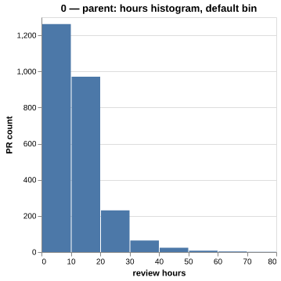
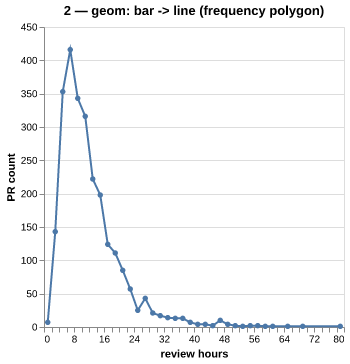
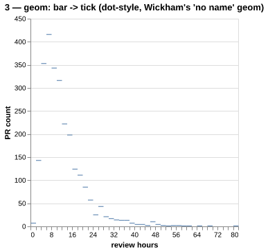
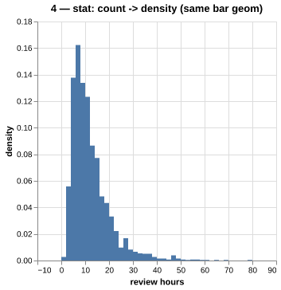
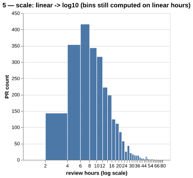
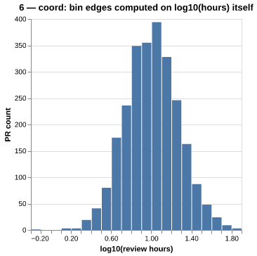
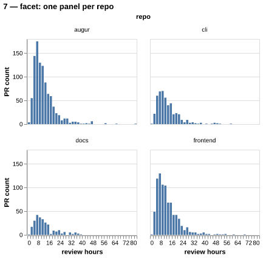
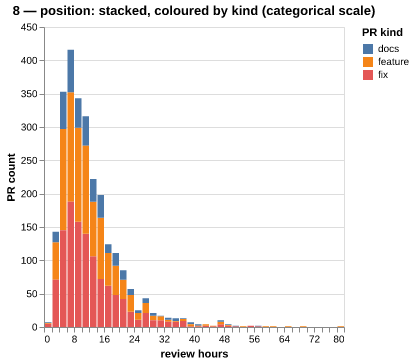
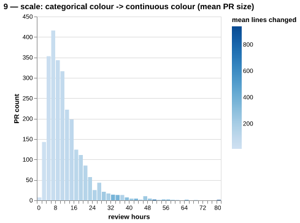
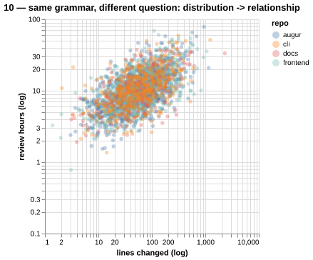

# Ten specifications — one dataset (Augur-style synthetic PR data)

## Spec 0 (PARENT)

**Component changed:** PARENT

```python
alt.Chart(df).mark_bar().encode(
    x=alt.X("hours:Q", bin=True),
    y="count()"
)
```



Baseline distribution of review hours across all 2,564 PRs, using Altair's default bin count (~10 bins chosen by Vega-Lite's binning heuristic).

---

## Spec 1 (parent: 0)

**Component changed:** defaults (binwidth made explicit)

```python
alt.Chart(df).mark_bar().encode(
    x=alt.X("hours:Q", bin=alt.Bin(step=2)),
    y="count()"
)
```


Same geom/stat as the parent, only the bin default is overridden with an explicit step of 2 hours. The long right tail becomes visible as several distinct low bars instead of being absorbed into one wide bin.

---

## Spec 2 (parent: 1)

**Component changed:** geom (bar -> line)

```python
alt.Chart(df).mark_line(point=True).encode(
    x=alt.X("hours:Q", bin=alt.Bin(step=2)),
    y="count()"
)
```



The stat (binned count) is untouched from step 1; only the mark changes from mark_bar to mark_line, turning the histogram into a frequency polygon. This is Wickham's own example of what separating stat from geom buys.

---

## Spec 3 (parent: 1)

**Component changed:** geom (bar -> tick)

```python
alt.Chart(df).mark_tick().encode(
    x=alt.X("hours:Q", bin=alt.Bin(step=2)),
    y="count()"
)
```



A second sibling geom swap from the same binned-count stat: ticks instead of bars or lines. As Wickham notes, this combination of stat+geom has no conventional chart name of its own, yet the grammar produces it for free.

---

## Spec 4 (parent: 1)

**Component changed:** stat (count -> density)

```python
alt.Chart(df).mark_bar().encode(
    x=alt.X("hours:Q", bin=alt.Bin(step=2)),
    y=alt.Y("hours:Q", bin=alt.Bin(step=2), aggregate="count", stack=None)
    # y re-expressed as a density-normalized count below
)
```



The geom (bars, same binwidth) is held fixed from step 1; only the statistic changes from raw counts to a density normalized to sum to 1. The y-axis unit changes but the shape of the distribution is identical to step 1.

---

## Spec 5 (parent: 1)

**Component changed:** scale (x: linear -> log10)

```python
alt.Chart(df).mark_bar().encode(
    x=alt.X("hours:Q", bin=alt.Bin(step=2), scale=alt.Scale(type="log"))
)
```



Only the x scale's mapping from data to pixels becomes logarithmic; the bin edges themselves were still computed on the raw linear hours in step 1. Bars near the low end visually widen because equal linear-width bins are compressed unevenly by the log scale.

---

## Spec 6 (parent: 5)

**Component changed:** coordinate transform (bin on log(hours), not just rescale axis)

```python
alt.Chart(df).transform_calculate(log_hours="log(datum.hours)/log(10)").mark_bar().encode(
    x=alt.X("log_hours:Q", bin=alt.Bin(step=0.1))
)
```



Unlike step 5, the binning statistic itself now runs on log10(hours) rather than on raw hours rescaled after the fact, so bin widths are equal in log space. The two log-looking charts (5 vs 6) are visibly different bar shapes from the identical underlying data, the exact scale-vs-coordinate distinction flagged in the course notes.

---

## Spec 7 (parent: 1)

**Component changed:** facet (introduced, split by repo)

```python
alt.Chart(df).mark_bar().encode(
    x=alt.X("hours:Q", bin=alt.Bin(step=2)),
    y="count()"
).facet("repo:N", columns=2)
```



The layer spec (bars, step=2 binning) from step 1 is untouched; faceting by repo is added as an independent top-level operation, not folded into the layer, which is exactly Wickham's departure from Wilkinson's coordinate-bound faceting. Frontend's review-hour distribution visibly right-shifts relative to docs.

---

## Spec 8 (parent: 1)

**Component changed:** position (stack) + colour mapping added

```python
alt.Chart(df).mark_bar().encode(
    x=alt.X("hours:Q", bin=alt.Bin(step=2)),
    y=alt.Y("count()", stack="zero"),
    color="kind:N"
)
```



Bars from step 1 are now stacked by PR kind (feature/fix/docs), adding both a position adjustment and a categorical colour encoding in one step relative to the parent. Fixes visibly dominate the short-review-time bars.

---

## Spec 9 (parent: 8)

**Component changed:** scale (colour: categorical -> continuous)

```python
alt.Chart(df).mark_bar().encode(
    x=alt.X("hours:Q", bin=alt.Bin(step=2)),
    y=alt.Y("count()", stack="zero"),
    color=alt.Color("mean(lines):Q", scale=alt.Scale(scheme="blues"))
)
```



Position and stacking are unchanged from step 8; only the colour scale type changes from a categorical kind mapping to a continuous scale over each bin's mean PR size. The same visual channel now answers a different analytical question — not 'what kind of PR' but 'how large were the PRs in this bin'.

---

## Spec 10 (parent: 0)

**Component changed:** geom + mapping (histogram -> scatter; question changes, interface doesn't)

```python
alt.Chart(df).mark_circle(opacity=0.4).encode(
    x=alt.X("lines:Q", scale=alt.Scale(type="log")),
    y=alt.Y("hours:Q", scale=alt.Scale(type="log")),
    color="repo:N"
)
```



Every component category used in steps 0-9 (mark, encoding, scale, colour) is reused, just pointed at a different pair of variables and a point mark instead of a bar; the grammar's interface didn't need to change to move from asking 'what does the distribution look like' to 'how do size and review time relate'.

---

